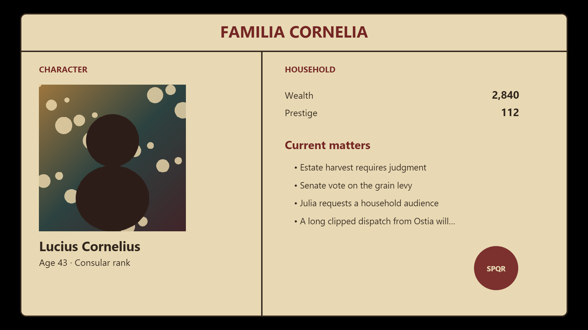
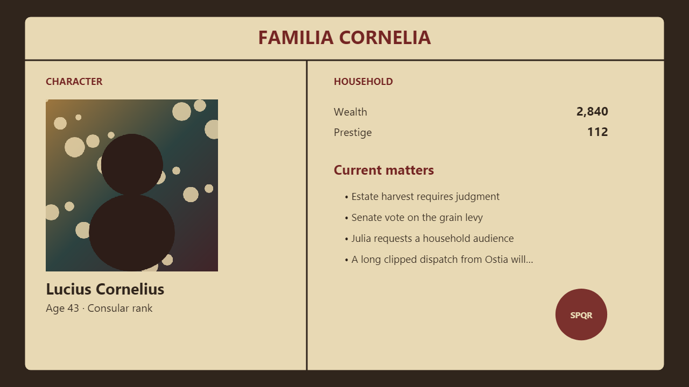
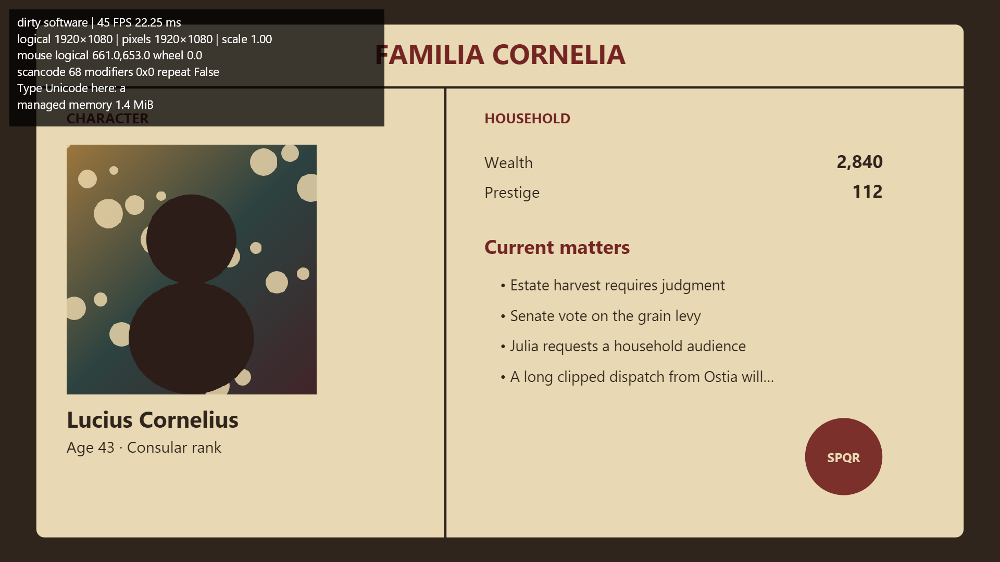

# NR2 desktop evidence — 2026-09-07 UTC

These are actual workstation outputs. Absolute checkout paths in text logs are
normalized to `<worktree>` and trailing whitespace is trimmed; numeric measurements and diagnostics are unchanged.
Environment metadata is in [environment.json](environment.json). No production
sandbox exists: the images below come from Gens.NativeSpike.

## Commands and evidence

Use .NET SDK 10.0.100 (global.json). Commands ran from the repository root.

| Command | Evidence | Result |
|---|---|---|
| `dotnet restore Gens.slnx` | restore.txt | pass |
| `dotnet build Gens.slnx --no-restore -c Release` | build-final.txt | pass |
| `dotnet test Gens.slnx --no-restore --no-build -c Release` | tests-final.txt | 1,690 passed |
| `dotnet format Gens.slnx --no-restore --verify-no-changes` | format-final.txt | see exit code |
| `dotnet format experiments/Gens.NativeSpike --no-restore --verify-no-changes` | spike-format-verify.txt | exit 0 |
| `dotnet run --project tools/Gens.ContentCompiler -- validate content` | content-validate.txt | 59 definitions valid |
| `dotnet run --project tools/Gens.ContentCompiler -- compile content artifacts/content/catalog.json` | content-compile.txt | pass |
| `bash scripts/verify-deterministic-build.sh` | deterministic-final.txt | matching hashes |
| `dotnet run -c Release --project benchmarks/Gens.Simulation.Benchmarks -- --job Dry` | benchmarks-dry-final.txt | one Dry benchmark executed |
| `./scripts/publish-native-spike.ps1` | publish-win.txt | pinned Windows native publish |
| `dotnet publish experiments/Gens.NativeSpike -c Release -r linux-x64 --self-contained false -o artifacts/native-spike/linux-x64` | publish-linux.txt | compile/publish pass; SDL missing |
| `dotnet publish experiments/Gens.NativeSpike -c Release -r osx-arm64 --self-contained false -o artifacts/native-spike/osx-arm64` | publish-mac.txt | compile/publish pass; SDL missing |
| `./scripts/test-native-spike-packaging.ps1` | native-payloads.txt | expected failure: Linux/macOS SDL absent |

For rows below, the command prefix is
`./artifacts/native-spike/win-x64/Gens.NativeSpike.exe`.

| Arguments | Evidence |
|---|---|
| `--headless --self-test` | self-test-final.txt |
| `--benchmark` | software-final.txt |
| `--gpu-benchmark` | gpu-verified.txt |
| `--text-benchmark` | text-final.txt; chronicle-3000.txt; chronicle.png |
| `--svg` | svg.txt; svg-features.png |
| `--allocations` | allocations.txt |
| `--vsync` | vsync.txt |
| `--soak` | soak-software.txt |
| `--soak --gpu` | soak-gpu-verified.txt |
| no arguments; interactive controls | interactive-second.txt; fullscreen-input.png |

GPU timings include GPU completion/swap; software timings exclude upload/present.
Both use ten warmups and 120 measured frames. GPU captures happen before swap and
outside measurement. The verified GPU log supersedes exploratory timings produced
before the resize/readback correction. OS/runtime/font differences mean hashes
should not be generalized to other configurations. The synthetic text corpus is
repetitive by construction; see the source sentence in ValidationModes.cs.

## Fresh-directory and missing-SDL protocol

Copied `artifacts/native-spike/win-x64` into `artifacts/nr2/fresh-win`, then ran its
apphost from the repository root (different working directory). Headless self-test
passed; native GPU window launch also succeeded. `fresh-self-test.txt` retains the
paired software hashes. The published interactive app separately demonstrated
resize/maximize/restore, minimize/restore, F11, F12, key/modifier/Latin text and wheel.

Copied the publish into `artifacts/nr2/no-sdl`, excluding SDL3.dll, then launched
its apphost from the repository root. `missing-sdl.txt` retains the actionable
DllNotFoundException and exit code 1. It did not use a system/PATH SDL fallback.

## CPU observation

For the interactive spike process, read `TotalProcessorTime`, waited five seconds,
then read it again with elapsed Stopwatch time. `idle.txt` is F3 animation off,
F2 dirty; `continuous.txt` is F3 off, F2 continuous. These are process CPU times,
not normalized machine utilization or power measurements.

## Inspected captures

## Exit status

NR2 incomplete; ADR 0015 proposed; Ticket 4 not started. Actual multi-monitor
fractional-DPI and IME checks cannot be run on the user's single-monitor/no-IME
setup. Native Linux/macOS SDL packaging and GPU resource plateau evidence are also
outstanding. A successful soak execution is not a leak-free result. See the
[full assessment](../../native-runtime-spike-results.md).
